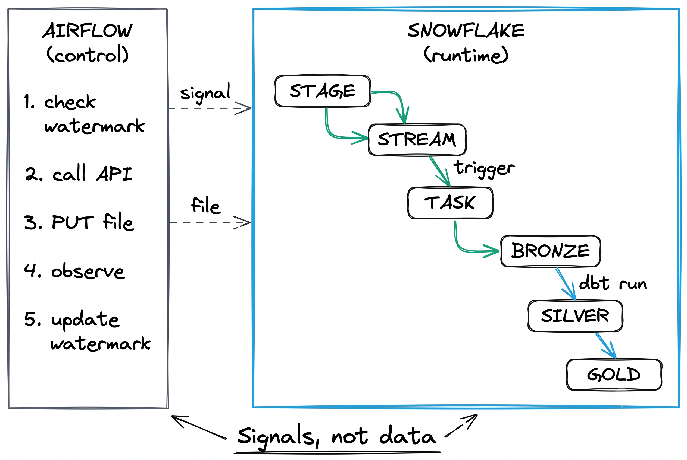
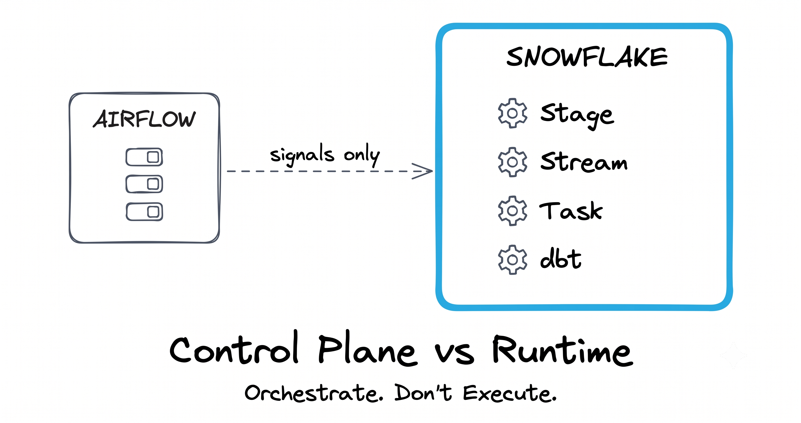

# Airflow + Snowflake: The Right Way

> A hands-on reference architecture for combining Apache Airflow with Snowflake, following the principle: **Airflow orchestrates, Snowflake executes.**

[](LICENSE)

---

## What This Is

A complete, runnable implementation of the **Snowflake Reference Architecture for Airflow Integration** — demonstrating how to build production-grade data pipelines where:

- **Airflow** is the control plane (fetch data, upload files, observe completion)
- **Snowflake** is the runtime (stage, stream, triggered task, dbt transform)
- **No data transformation happens in Airflow** — ever

This repo accompanies the Medium article series: **"Airflow + Snowflake: The Right Way"**

---

## Architecture



### The Core Principle



| Layer | Owner | Does | Does NOT |
|-------|-------|------|----------|
| **Airflow** | You (Docker/SPCS/MWAA) | Call APIs, handle pagination, PUT files, observe | Transform, join, deduplicate, aggregate |
| **Snowflake** | Snowflake | Stage → Stream → Task → Bronze → Silver → Gold | Call external APIs, manage schedules |

### Why This Matters


Most teams treat Airflow as both orchestrator AND executor. This leads to:
- Memory-killed workers at 3 AM
- 2-CPU containers trying to transform millions of rows
- Horizontal scaling of Airflow just to handle data volume

The fix: **let Snowflake do what Snowflake was built for.**


---

## How It Works (End-to-End Flow)


**Airflow touches steps 1-4 and 9.** Snowflake handles steps 5-8 autonomously.

---

## Article Series

| # | Article | What You Learn | Code Tag |
|---|---------|---------------|----------|
| 1 | [Stop Using Airflow Wrong](articles/01-stop-using-airflow-wrong.md) | Architecture philosophy | `repo-live` |
| 2 | [Incremental CDC Pipeline](articles/02-incremental-cdc-pipeline.md) | Watermarks + triggered tasks | `v0.1` |
| 3 | [dbt: Bronze to Gold](articles/03-dbt-bronze-to-gold.md) | Incremental models + QUALIFY dedup | `v0.2` |
| 4 | Multi-Source TaskGroups | Parallel ingestion from 3 APIs | `v0.3` |
| 5 | 10 Gotchas | War stories that save you days | `v0.4` |
| B1 | Airflow on SPCS | Enterprise self-hosted in Snowflake | `v1.0-spcs` |
| B2 | Migrating to MWAA | AWS managed Airflow + Snowpipe | `v1.0-mwaa` |

Each article builds on the previous one. Git tags mark the state of the repo at each article's publication.

---

## Local Development Stack


## Quick Start (Local Development)

### Prerequisites

- Docker Desktop (4GB+ RAM allocated)
- A Snowflake account (trial works fine)
- Private key (`.p8`) configured for your Snowflake user
- Python 3.10+ (for running tests locally)

### 1. Clone and Configure

```bash
git clone https://github.com/mcharni76/airflow-snowflake-how-to.git
cd airflow-snowflake-how-to
cp .env.example .env
# Edit .env with your Snowflake account details
```

### 2. Set Up Snowflake Objects

```bash
# Run scripts 01-05 in Snowsight or your SQL tool of choice
snowflake/01_setup_environment.sql
snowflake/02_create_stage_and_stream.sql
snowflake/03_create_bronze_objects.sql
snowflake/04_create_orch_objects.sql
snowflake/05_create_triggered_task.sql
```

### 3. Start the Stack

```bash
docker compose up --build -d
```

This brings up:
- **Mock API** at http://localhost:8099/docs (FastAPI with Swagger UI)
- **Airflow Webserver** at http://localhost:8080 (admin/admin)
- **PostgreSQL** (Airflow metadata — internal, no port exposed)

### 4. Trigger the Pipeline

1. Open http://localhost:8080
2. Find `eventhub_single_source_pipeline` DAG
3. Unpause → Trigger
4. Watch it extract from Mock API → PUT to Snowflake → observe task completion

---

## Project Structure

```
airflow-snowflake-how-to/
├── docker-compose.yaml          # Full local stack
├── .env.example                 # Configuration template
├── mock-api/                    # Simulated vendor API (FastAPI)
├── airflow/                     # DAGs (control plane only)
│   └── dags/
│       ├── single_source_pipeline.py
│       └── multi_source_pipeline.py
├── snowflake/                   # DDL scripts (numbered, idempotent)
├── dbt/                         # Transformation models
│   └── models/{silver,gold}/
├── spcs/                        # Bonus: Enterprise SPCS deployment
├── mwaa/                        # Bonus: AWS MWAA migration guide
├── tests/                       # Unit + integration tests
├── articles/                    # Medium article sources (markdown)
└── docs/
    ├── DECISIONS.md             # Architecture Decision Records (ADRs)
    ├── diagrams/                # Excalidraw source + PNG exports
    ├── PRODUCT_VISION.md
    ├── ROADMAP.md
    └── REQUIREMENTS.md
```

---

## Design Decisions

| Decision | Rationale |
|----------|-----------|
| Internal stage (not S3) | Local dev — no cloud bucket needed |
| Key-pair auth (not password) | More secure, no password rotation headaches |
| Triggered task (not scheduled) | Event-driven: runs only when files arrive |
| Reschedule sensor (not poke) | Frees Airflow worker while waiting |
| MERGE at Bronze | Idempotent: safe to replay any batch |
| QUALIFY at Silver | Deduplicate without separate staging table |
| Watermark in Snowflake table | Single source of truth (not XCom, not Airflow DB) |

For detailed ADRs, see [docs/DECISIONS.md](docs/DECISIONS.md).

---

## Deployment Options


### Option 1: Docker Compose (Local Development)

> **Covered in:** Articles 1–5

Run the entire stack on your laptop. Perfect for learning, prototyping, and demos.

| Pros | Cons |
|------|------|
| Zero cloud cost | Not production-ready |
| Works offline (except Snowflake calls) | Single machine — no HA |
| Full control over all components | Manual scaling |
| Fast iteration (hot-reload DAGs) | No persistent storage without volumes |
| Identical environment for all devs | Resource-limited by your machine |

---

### Option 2: Snowpark Container Services (SPCS)

> **Covered in:** Bonus Article 1

Run Airflow **inside Snowflake** as a containerized service. Zero egress, single bill, native RBAC.

| Pros | Cons |
|------|------|
| Zero data egress (Airflow → Snowflake is internal) | Snowflake-specific (vendor lock-in) |
| Single bill (compute pool credits) | Newer service — smaller community |
| Inherits Snowflake RBAC (no separate IAM) | Cold start on compute pool resume |
| OAuth token auto-injection (no key files) | Limited to Snowflake networking model |
| Block storage for DAG/log persistence | Requires Enterprise+ edition |
| Network rules = zero-trust egress | Debugging requires `SYSTEM$GET_SERVICE_LOGS` |
| Image repository (air-gapped, no Docker Hub) | No native Airflow UI (custom ingress needed) |
| Auto-scaling via compute pool policies | GPU not needed but pool sizing matters |

**Best for:** Enterprises already deep in Snowflake, wanting single-pane governance and zero-egress architecture.

---

### Option 3: Amazon MWAA (Managed Workflows for Apache Airflow)

> **Covered in:** Bonus Article 2

AWS fully manages the Airflow infrastructure. You just deploy DAGs to S3.

| Pros | Cons |
|------|------|
| Fully managed (no infra to maintain) | AWS-only (no multi-cloud) |
| Auto-scaling workers | Expensive at scale ($0.49/hr base + workers) |
| Native S3 integration for DAGs | Limited Airflow version choices |
| IAM-based access control | Plugin/provider installation can be tricky |
| CloudWatch logging built-in | Cold start on worker scaling (2-5 min) |
| VPC-native (private networking) | No SSH access to workers |
| Automatic patching and updates | Environment updates can take 20+ min |

**Best for:** AWS-native shops that want managed Airflow without ops burden and already use S3/IAM.

---

### Option 4: Astronomer (Astro)

> **Not covered in this series** (commercial product)

Premium managed Airflow platform with advanced features, dedicated support, and multi-cloud.

| Pros | Cons |
|------|------|
| Best-in-class managed Airflow experience | Commercial license ($$) |
| Multi-cloud (AWS, GCP, Azure) | Vendor dependency |
| Advanced observability + alerting | Overkill for small teams |
| DAG versioning + CI/CD built-in | Learning curve for Astro-specific features |
| Dedicated support + SLAs | Pricing not transparent |
| Fastest Airflow version adoption | — |

**Best for:** Teams that need premium support, multi-cloud, and advanced governance without managing infrastructure.

---

### Option 5: Google Cloud Composer

> **Not covered in this series** (GCP-specific)

GCP's managed Airflow service, built on Google Kubernetes Engine.

| Pros | Cons |
|------|------|
| Fully managed on GKE | GCP-only |
| Native integration with BigQuery, GCS, Dataflow | Expensive (GKE cluster always running) |
| IAM + Workload Identity | Slower Airflow version updates |
| Composer 2 = better scaling | Environment creation takes 20-30 min |
| Private IP environments available | Complex networking (VPC, firewall rules) |

**Best for:** GCP-native organizations already invested in Google Cloud ecosystem.

---

### Option 6: Self-Hosted Kubernetes

> **Not covered in this series** (ops-heavy)

Run Airflow on your own K8s cluster using the official Helm chart.

| Pros | Cons |
|------|------|
| Full control over everything | You own all the ops (upgrades, scaling, monitoring) |
| Any cloud or on-prem | Requires K8s expertise |
| KubernetesExecutor for dynamic scaling | Complex setup (Helm + secrets + networking) |
| Cost-efficient at scale | No managed support |
| Custom images + plugins freely | Security hardening is your responsibility |
| Air-gapped environments possible | Day-2 operations (logging, metrics, alerting) |

**Best for:** Platform teams with strong K8s expertise who need maximum flexibility or have compliance requirements preventing managed services.

---

### Deployment Comparison Matrix

| Criteria | Docker Compose | SPCS | MWAA | Astronomer | Cloud Composer | Self-Hosted K8s |
|----------|:-:|:-:|:-:|:-:|:-:|:-:|
| Setup complexity | Low | Medium | Medium | Low | Medium | High |
| Operational burden | None (dev) | Low | Low | None | Low | High |
| Cost (small) | Free | $ | $$ | $$$ | $$ | $ |
| Cost (large) | N/A | $$ | $$$ | $$$$ | $$$ | $$ |
| Snowflake integration | Good | Excellent | Good | Good | Good | Good |
| Multi-cloud | N/A | No | No | Yes | No | Yes |
| Auto-scaling | No | Yes | Yes | Yes | Yes | Yes |
| Data egress | Outbound | Zero | Outbound | Outbound | Outbound | Varies |
| Enterprise governance | No | Excellent | Good | Good | Good | Manual |

---

## Running the Tests

```bash
pip install -r tests/requirements-test.txt
pytest tests/ -v
```

---

## Contributing

This is a reference implementation, not a product. Issues and PRs welcome for:
- Bug fixes
- Documentation improvements
- Additional gotchas
- Language/framework-specific variations

---

## License

MIT — see [LICENSE](LICENSE)

---

## Author

**Marawen Charni** — Solutions Engineer at Snowflake, based in the Middle East. Building things that make data teams more productive.

- Medium: [@marawen.cherni](https://medium.com/@marawen.cherni)
- LinkedIn: [/in/mcharni](https://www.linkedin.com/in/mcharni)
